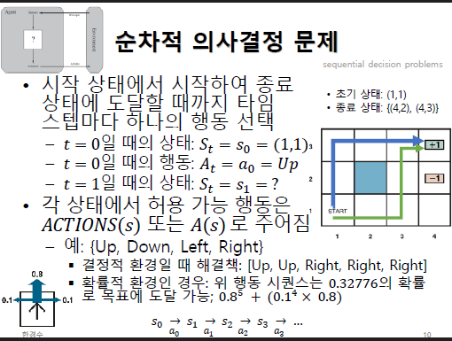
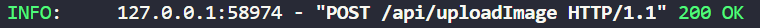
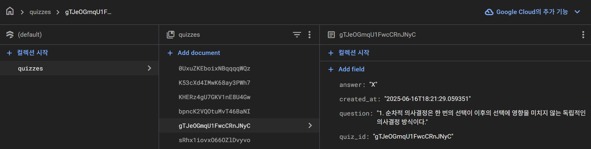

# 📝api 명세서

## 1. Server port 번호
8080
## 2. 주소(Server)
http://localhost:8080/

## 3. 이미지 업로드 및 퀴즈 생성
### URL
```http
/api/uploadImage
```
### Method
- POST
### 설명
- 이미지를 업로드하고 키워드 및 퀴즈를 생성한다.<br>
- 이미지 업로드 -> VLM 키워드 추출 -> LLM 퀴즈 생성<br>
- 요청시 퀴즈 id 
### 요청 해더
- Content-Type: multipart/form-data
### 요청 파일 형식
- file: UploadFile (jpg/png)
#### 업로드 이미지

#### 결과
``` json
{
    "quiz": [
        {
            "quiz_id": "gTJeOGmqU1FwcCRnJNyC",
            "question": "1. 순차적 의사결정은 한 번의 선택이 이후의 선택에 영향을 미치지 않는 독립적인 의사결정 방식이다."
        },
        {
            "quiz_id": "K53cXd4IMwK68ay3PWh7",
            "question": "2. 최적 정책은 주어진 상황에서 가능한 가장 좋은 선택을 결정하는 원칙이다."
        },
        {
            "quiz_id": "KHERz4gU7GKV1nE8U4Gw",
            "question": "3. 확률적 상태 전이는 다음 상태가 현재 상태와 완전히 독립적으로 결정되는 것을 의미한다."
        }
    ]
}
```
### 응답 형식(성공)
- 200 OK



## 4. 퀴즈 내용 DB 저장후 결과
### URL
```http
/api/checkAnswer
```
### Method
- POST
### 설명
- DB(FireBase)에 퀴즈를 저장하고 해당 퀴즈 결과를 리턴
### 요청 해더
- Content-Type: application/json
### 요청 파일 형식
#### 업로드 json 형식
```json
[
    {"quiz_id": "3YqXgiRb6QZnzLg0lCJn","user_answer": 1},
    {"quiz_id": "OcoQ1KxMABSu395eOPTC","user_answer": 0},
    {"quiz_id": "Vpcqy81wkjFfe3uQ3DGS","user_answer": 1}
]
```
- 퀴즈 아이디는 uuid 방식 
#### 결과
```json
[
    {
        "quiz_id": "3YqXgiRb6QZnzLg0lCJn",
        "question": "1. Bellman-Ford 알고리즘은 음의 가중치를 가진 그래프에서 최단 경로를 찾는 데 사용되지 않는다.",
        "user_answer": "O",
        "correct_answer": "X",
        "is_correct": false
    },
    {
        "quiz_id": "OcoQ1KxMABSu395eOPTC",
        "question": "2. 최단 경로 문제는 그래프의 두 노드 사이에서 가장 짧은 경로를 찾는 문제다.",
        "user_answer": "X",
        "correct_answer": "O",
        "is_correct": false
    },
    {
        "quiz_id": "Vpcqy81wkjFfe3uQ3DGS",
        "question": "3. 그래프 간선 완화는 주어진 노드의 가중치를 갱신하는 과정이라고 표현할 수 있다.",
        "user_answer": "O",
        "correct_answer": "O",
        "is_correct": true
    }
]
```
### 응답 성공
-  200 OK


### DB 저장


## 5. 퀴즈 id로 찾기
### URL
```http
/api/quiz/{quiz_id}
```
### Method
- GET
### 설명
- DB(FireBase)에 저장된 퀴즈를 id로 찾아서 가져옴
### 요청 해더
- Content-Type: application/json
### 요청 파일 형식
```http
http://localhost:8080/api/quiz/KHERz4gU7GKV1nE8U4Gw
```
#### 업로드 json 형식
```json
{
    "created_at": "2025-06-16T18:21:29.416914",
    "quiz_id": "KHERz4gU7GKV1nE8U4Gw",
    "question": "3. 확률적 상태 전이는 다음 상태가 현재 상태와 완전히 독립적으로 결정되는 것을 의미한다.",
    "answer": "X"
}
```