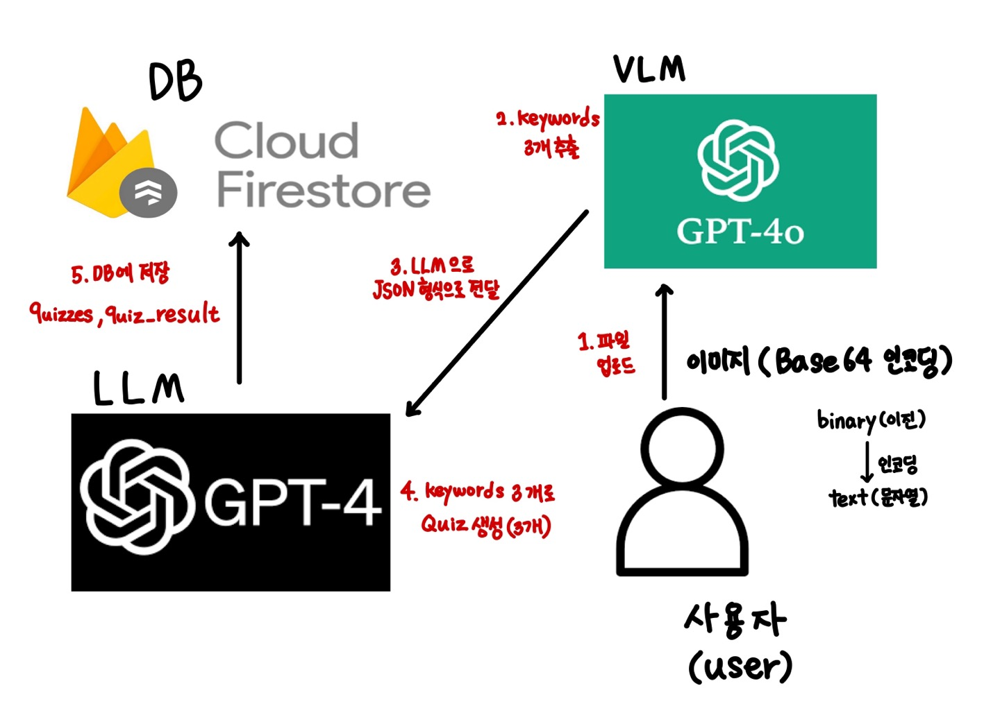
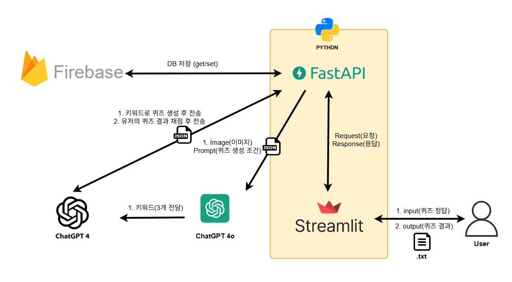

# 멀티모달 퀴즈 생성 시스템
## 🛠️ 프로젝트 소개
이미지 + 택스트 기반 퀴즈 생성기로 사용가자 업로드한 이미지를 VLM이 분석하여 주요 키워드를 추출하고, LLM이 이를 바탕으로 다양한 형태의 퀴즈를 자동 생성하는 멀티모달 AI 시스템이다.

## 🔧 핵심 기술

**`VLM(GPT-4o, (구)GPT-vision)`**: 이미지를 분석하여 키워드 추출<br>
**`LLM(GPT-4)`**: 분석한 키워를 주제로 o/x 퀴즈 생성<br>
**`FireBase(DB)`**: LLM을 통해 나온 내용을 실시간으로 FireBase에 저장<br>

## 시스템 구현 구성도


## 📂 프로젝트 구조
### api/
`answer_checker.py`: 정답인지 아닌지를 체크한다.<br>
`quiz_maker.py`: VLM -> LLM 으로 퀴즈를 생성한다.<br>
`answer_get.py`: id를 통해서 저장된 퀴즈를 가져온다.<br>
### DataBase/
`firebase.py`: Firebase를 초기화 한다.<br>
`firebase-key.json`: 파이어베이스 키를 저장한다.<br>
### venv/
가상환경이 설정된 폴더다.
### myopenai/
`ChatTest.py`: GPT-4 연결, 퀴즈 생성<br>
`apikey.env`: api 키 저장 -> 깃허브 업로드 금지<br>
### vlm_myopenai
`GptVision.py`: GPT-4o 연결, 이미지 읽고 키워드 생성<br>
`apikey.env`: api 키 저장<br>
### test/iamage/
이미지 저장 폴더다.
## ⚙️ 개발 환경
### 가상환경 활성화
```bash
.\venv\Scripts\activate
```
### 필요한 패키지 설치
```bash
pip install -r requirements.txt
```
## 🚀 서버 실행 방법
### 포트 번호
백엔드 `PORT: 8080`<br>
프론트 `PORT: *` -> 어디서든지 실행 가능 추후에 배포에는 변경 예정<br>
### 실행 코드
```bash
uvicorn main:app --reload --port 8080
```

## 📝api 목록
### 이미지 업로드 및 퀴즈 생성 주소 (POST)
`/api/uploadImage`<br>
### 퀴즈 정답 생성 주소 (POST)
`/api/checkAnswer`<br>
### 퀴즈 가져오기 주소 (GET)
`/api/quiz/{quiz_id}`<br>

## 🔑 api key 목록
### DataBase/
**`gpt-quiz-db-firebase-adminsdk-fbsvc-e84673227c.json`**<br>
Firebase 키 (DB)<br>
### myopenai/
**`apikey.env`**<br>
GPT-4 키 (LLM)<br>
### vlm_myopenai/
**`apikey.env`**<br>
GPT-4o 키 (VLM)<br>
